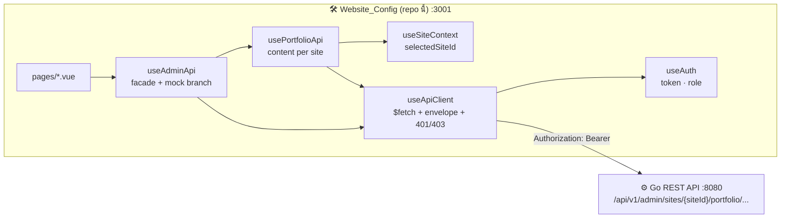

<div align="center">

# Website Config — Admin Dashboard

**หน้าหลังบ้านสำหรับจัดการหลายเว็บไซต์ portfolio จากที่เดียว — sites, users, สิทธิ์ และเนื้อหาทุก section**

Manage every portfolio site from one dashboard.

[](https://nuxt.com)
[](https://vuejs.org)
[](https://www.typescriptlang.org)
[](https://tailwindcss.com)
[](https://i18n.nuxtjs.org)
[](#-สถาปัตยกรรม)

[ฟีเจอร์](#-ฟีเจอร์) ·
[เริ่มต้นใช้งาน](#-เริ่มต้นใช้งาน) ·
[สถาปัตยกรรม](#-สถาปัตยกรรม) ·
[หน้าและสิทธิ์](#-หน้าและสิทธิ์) ·
[โครงสร้างโปรเจกต์](#-โครงสร้างโปรเจกต์) ·
[เอกสาร](#-เอกสารเพิ่มเติม)

</div>

---

## 🧩 ระบบนี้ประกอบด้วยอะไร

Repo นี้เป็น **1 ใน 3 ส่วน** ของระบบ Multi-Site Portfolio ทั้ง 3 repo ต่อกันด้วย REST API และ contract `site_id`

| Repo | หน้าที่ | Stack | Port dev |
|---|---|---|---|
| [ADMIN_API_CONFIG](https://github.com/RujikornTonkaow/ADMIN_API_CONFIG) | Backend REST API + MongoDB | Go 1.22 · MongoDB 7 · JWT | 8080 |
| **Admin_Websie_Config** (repo นี้) | Admin dashboard จัดการ sites / users / content | Nuxt 3 (SPA) · Tailwind · i18n | 3001 |
| [Portfolio](https://github.com/RujikornTonkaow/Portfolio) | เว็บ portfolio หน้าบ้าน แสดงเนื้อหาตาม domain | Nuxt 3 (SSR) · Tailwind · Three.js | 3000 |

Dashboard นี้ **ไม่มี database ของตัวเอง** คุยกับ backend ผ่าน REST + JWT เท่านั้น

---

## ✨ ฟีเจอร์

| | ฟีเจอร์ | รายละเอียด |
|---|---|---|
| 🔐 | **Login ด้วย JWT** | username/password → รับ token จาก backend เก็บใน `localStorage` decode role จาก payload |
| 🗂️ | **เลือก site จาก sidebar** | โหลด site ที่ user มีสิทธิ์ทั้งหมด เลือกได้จาก sidebar ทุก request ของเนื้อหาจะ scope ด้วย `siteId` ที่เลือก |
| ✏️ | **จัดการเนื้อหา portfolio** | site settings, hero, about, skills, projects, experiences, social links — CRUD + reorder + upload รูป |
| 📬 | **อ่านข้อความ contact** | รายการข้อความจากเว็บหน้าบ้าน mark read, ลบ พร้อมนับ unread บน dashboard |
| 👥 | **จัดการ users** | (admin+) สร้าง/แก้/ลบ user, เปลี่ยน password, กำหนด site memberships |
| 🌐 | **จัดการ sites** | (super_admin) สร้าง/แก้/ลบ site, ตั้ง `domains`, เลือก `type` (portfolio / shop / finance) |
| 🛡️ | **RBAC ฝั่ง UI** | ซ่อนเมนูและบล็อก route ตาม role (`viewer` < `editor` < `admin` < `super_admin`) backend เป็นผู้ตัดสินจริง |
| 🌍 | **สองภาษา** | EN / TH ผ่าน `@nuxtjs/i18n` สลับได้ที่ header จำค่าใน cookie |
| 🧪 | **Mock mode** | ทดลอง UI ทุกหน้าโดยไม่ต้องมี backend ข้อมูลจาก `useMockData.ts` |
| 🧱 | **Module-based sidebar** | เมนู shop / finance จะแสดงเมื่อ backend มี site type นั้นจริง (เตรียมขยายระบบ) |

---

## 🚀 เริ่มต้นใช้งาน

### สิ่งที่ต้องมี

- Node.js 20 ขึ้นไป
- Backend [ADMIN_API_CONFIG](https://github.com/RujikornTonkaow/ADMIN_API_CONFIG) รันอยู่ที่ `http://localhost:8080` — ข้ามได้ถ้าจะลองแค่ Mock mode

### ติดตั้งและรัน

```bash
# 1. Clone
git clone https://github.com/RujikornTonkaow/Admin_Websie_Config.git
cd Admin_Websie_Config

# 2. ติดตั้ง dependencies (postinstall จะรัน nuxt prepare)
npm install

# 3. ตั้งค่า environment variables
cp .env.example .env

# 4. เริ่ม dev server
npm run dev
```

เปิด `http://localhost:3001` แล้ว login ด้วย user seed ของ backend: `admin` / `changeme123`

> 💡 Backend ต้องใส่ `http://localhost:3001` ใน `ALLOWED_ORIGINS` มิฉะนั้น CORS จะ block (ค่า default ของ `docker-compose.yml` ใส่ไว้ให้แล้ว)

### Environment Variables

| ตัวแปร | คำอธิบาย |
|---|---|
| `NUXT_PUBLIC_API_BASE_URL` | base URL ของ Go API เช่น `http://localhost:8080` (dev) หรือ URL ของ Render (prod) |

`localStorage` keys ที่ใช้: `admin_token`, `admin_mock_mode`, `admin_selected_site_id` · cookie: `i18n_locale`

### Scripts

| คำสั่ง | ทำอะไร |
|---|---|
| `npm run dev` | เริ่ม dev server ที่ port 3001 |
| `npm run build` | build เป็น SPA ลง `.output/` |
| `npm run generate` | สร้าง static site |
| `npm run preview` | เปิด build ที่ได้ |
| `npm run lint` | ESLint ผ่าน `@nuxt/eslint` |
| `npm run typecheck` | `nuxt typecheck` |

---

## 🏗️ สถาปัตยกรรม

Render ฝั่ง client ทั้งหมด (`ssr: false`) เพราะต้องอ่าน token จาก `localStorage` ก่อนทุก request



### Login และ route guard

```mermaid
flowchart TD
    A[เปิดหน้าใดก็ได้] --> B[middleware/auth.global.ts]
    B --> C{มี token?}
    C -- ไม่ --> L[/login]
    C -- ใช่ --> D{role ผ่านกฎของ path?}
    D -- ไม่ --> H[redirect /]
    D -- ใช่ --> E[layouts/default.vue โหลด sites]
    E --> F[เลือก site → ประกอบ path ทุก request]
    L -- POST /admin/auth/login --> G[เก็บ token ใน localStorage<br/>decode role → navigateTo /]
```

### ชั้นของ composables

```
pages/*.vue
  └─ useAdminApi()        ← facade รวม users / sites / memberships + re-export portfolio api + upload
       ├─ usePortfolioApi() ← siteSettings / hero / about / skills / projects / experiences / socialLinks / contacts
       │     └─ useSiteContext()  ← selectedSiteId, getPortfolioAdminPath('projects')
       │                              → "/api/v1/admin/sites/{siteId}/portfolio/projects"
       └─ useApiClient()   ← apiFetch / upload / getUploadUrl / แกะ envelope { data | error | meta }
             └─ useAuth()  ← token, role, getAuthHeaders(), login / logout
```

### Tech stack

| ส่วน | เทคโนโลยี |
|---|---|
| Framework | Nuxt 3 (^3.15) · SPA (`ssr: false`) |
| UI | Vue 3.5 Composition API (`<script setup lang="ts">`) |
| ภาษา | TypeScript 5.8 |
| Styling | Tailwind CSS ผ่าน `@nuxtjs/tailwindcss` · ฟอนต์ Inter |
| Icons | Iconify ผ่าน `@nuxt/icon` (`<Icon name="mdi:...">`) |
| i18n | `@nuxtjs/i18n` v10 · locales `en` / `th` · strategy `no_prefix` |
| State | Nuxt `useState` + composables (ไม่ใช้ Pinia) |
| HTTP | Nuxt `$fetch` (ofetch) ผ่าน wrapper `useApiClient` |
| Lint | `@nuxt/eslint` |
| Backend | Go REST API (repo แยก) ผ่าน `NUXT_PUBLIC_API_BASE_URL` |

---

## 🔑 หน้าและสิทธิ์

| Path | ใช้ทำอะไร | viewer | editor | admin | super_admin |
|---|---|---|---|---|---|
| `/` | dashboard: นับ skills / projects / experiences, contacts + unread | ✅ | ✅ | ✅ | ✅ |
| `/contacts` | ตารางข้อความ เปิดอ่าน (mark read), ลบ (editor+) | ✅ | ✅ | ✅ | ✅ |
| `/site-settings` `/hero` `/about` `/skills` `/projects` `/experiences` `/social-links` | แก้เนื้อหา portfolio ของ site ที่เลือก | ❌ | ✅ | ✅ | ✅ |
| `/users` | CRUD users, เปลี่ยน password, กำหนด memberships ต่อ site | ❌ | ❌ | ✅ | ✅ |
| `/sites` | CRUD sites: name, slug, type, domains | ❌ | ❌ | ❌ | ✅ |

| Role | สิทธิ์ |
|---|---|
| `super_admin` | เห็นทุก site, จัดการ sites / users ทุกคน, สร้าง `super_admin` ได้ |
| `admin` | จัดการ content และ users เฉพาะ site ที่ได้รับ access |
| `editor` | แก้ content เฉพาะ site ที่ได้รับ access |
| `viewer` | ดู Dashboard / Contacts เฉพาะ site ที่ได้รับ access |

การซ่อนเมนูทำที่ `config/navigation.ts` (`minRole`) และการบล็อก route ทำที่ `middleware/auth.global.ts` + `config/permissions.ts`
`site_members` เป็น access list ไม่ใช่ per-site role — role จริงมาจาก JWT เสมอ

---

## 📂 โครงสร้างโปรเจกต์

```
Website_Config/
├── app.vue                      # root: <NuxtLayout><NuxtPage/>
├── nuxt.config.ts               # modules, i18n, runtimeConfig, ssr:false, vite proxy
├── pages/                       # 12 หน้า (route = ชื่อไฟล์): login, index, contacts, site-settings, hero,
│                                #   about, skills, projects, experiences, social-links, users, sites
├── layouts/
│   ├── default.vue              # sidebar + header + โหลด sites + site switcher
│   └── auth.vue                 # layout หน้า login
├── middleware/auth.global.ts    # route guard (token + role)
├── components/                  # AdminSidebar, AdminHeader, ConfirmDialog, FormImageUpload,
│                                #   FormTagInput, LanguageSwitcher, Toast
├── composables/                 # useAuth, useApiClient, useSiteContext, usePortfolioApi, useAdminApi, useMockData
├── config/
│   ├── modules.ts               # module portfolio / shop / finance
│   ├── navigation.ts            # เมนู sidebar + minRole
│   └── permissions.ts           # role levels + path rules
├── i18n/
│   ├── i18n.config.ts
│   └── locales/{en,th}.json     # ข้อความ UI ทั้งหมด (เพิ่ม key ต้องเพิ่มทั้ง 2 ไฟล์)
├── types/                       # shared, auth, site, portfolio, admin (re-export)
├── assets/css/tailwind.css
├── GUIDE/                       # เอกสารเชิงลึก 01..08
└── .env.example
```

### กติกาก่อนแก้โค้ด

- **เพิ่มหน้าใหม่** ต้องทำ 4 อย่าง: สร้าง `pages/x.vue`, เพิ่มเมนูใน `config/navigation.ts`, เพิ่มข้อความใน `locales/en.json` + `th.json`, ถ้ามีกฎสิทธิ์พิเศษเพิ่มใน `config/permissions.ts`
- **ห้ามเรียก `$fetch` ตรงในหน้า** ให้ผ่าน `useAdminApi()` / `usePortfolioApi()` เสมอ
- **ทุก path ของ content ต้องผ่าน `getPortfolioAdminPath()`** ห้าม hardcode `/api/v1/admin/portfolio/...` (legacy ถูกถอดแล้ว)
- **ส่ง field ให้ backend ต้องตรง struct** เพราะ backend ใช้ `DisallowUnknownFields` ส่ง field เกินจะได้ 400
- **รูปภาพ** เก็บเป็น path relative (`/uploads/xxx.jpg`) แสดงผลด้วย `getUploadUrl()` เท่านั้น
- **เปลี่ยน site แล้วหน้า reload** เป็น behavior ที่ตั้งใจ เพื่อล้าง state ของ site เดิม
- หลังแก้เสร็จรัน `npm run typecheck`

---

## ☁️ Deploy

Build เป็น SPA แล้ว host ที่ไหนก็ได้ที่ serve static ได้ (Vercel, Netlify, Render Static)

```bash
npm run generate     # หรือ npm run build
```

1. ตั้ง `NUXT_PUBLIC_API_BASE_URL` เป็น URL ของ backend production (เช่น `https://admin-api-config.onrender.com`)
2. เพิ่ม origin ของ dashboard (เช่น `https://admin.example.com`) ใน `ALLOWED_ORIGINS` ของ backend
3. ตั้ง SPA fallback ให้ทุก path ไปที่ `index.html`

ปัญหา CORS และการตั้งค่า dev อยู่ใน [`GUIDE/08-CORS-AND-LOCAL-DEV.md`](./GUIDE/08-CORS-AND-LOCAL-DEV.md)

---

## 📚 เอกสารเพิ่มเติม

| ไฟล์ | เนื้อหา |
|---|---|
| [`GUIDE/01-SYSTEM-FLOW.md`](./GUIDE/01-SYSTEM-FLOW.md) | flow ตั้งแต่ login จนถึง CRUD |
| [`GUIDE/02-FILE-REFERENCE.md`](./GUIDE/02-FILE-REFERENCE.md) | อธิบายทุกไฟล์ |
| [`GUIDE/03-TECH-STACK.md`](./GUIDE/03-TECH-STACK.md) | รายละเอียดเทคโนโลยี |
| [`GUIDE/04-API-REFERENCE.md`](./GUIDE/04-API-REFERENCE.md) | endpoint ที่ dashboard ใช้ |
| [`GUIDE/05-AUTHENTICATION-RBAC.md`](./GUIDE/05-AUTHENTICATION-RBAC.md) | JWT, role hierarchy, middleware |
| [`GUIDE/06-SETUP-GUIDE.md`](./GUIDE/06-SETUP-GUIDE.md) | setup + env |
| [`GUIDE/07-MULTI-SITE-ARCHITECTURE.md`](./GUIDE/07-MULTI-SITE-ARCHITECTURE.md) | แนวคิด multi-site, module config, site context |
| [`GUIDE/08-CORS-AND-LOCAL-DEV.md`](./GUIDE/08-CORS-AND-LOCAL-DEV.md) | ปัญหา CORS และการตั้งค่า dev |

---

## 👥 ผู้พัฒนา

- [@RujikornTonkaow](https://github.com/RujikornTonkaow)

## 📄 License

โปรเจกต์นี้ยังไม่ได้ระบุ license — เพิ่มไฟล์ `LICENSE` ได้ตามต้องการ (เช่น MIT)

<div align="center">
<sub>Built with Nuxt · Vue · Tailwind · ☕</sub>
</div>
